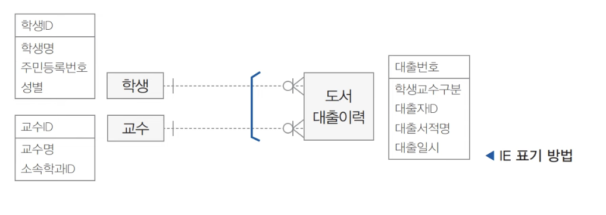
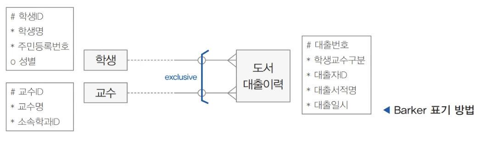

# SQLD 영진 강의 메모

SQLD 강의를 들으며 정리한 데이터 모델링/SQL 이론 메모

---

## 엔터티(Entity)

엔터티가 되기 위한 조건은 다음과 같다.

- 저장하고자 하는 대상
- 업무에 필요할 것
- 집합적(인스턴스 2개 이상)
- 포괄적(너무 세세하지 않게)
- 속성을 1개 이상 가질 것
- 다른 엔터티와 1개 이상 관계를 가질 것
- 식별자가 존재할 것

### 엔터티 종류

- 유무형 분류: 유형 / 개념 / 사건
- 발생 시점 분류
  - **기본**: 독립적인 대상
  - **메인**: 업무 중심
  - **행위**: 메인에서 쌓이는 것

### 엔터티 명명 규칙

- 현업 용어를 사용한다 (개발자에게만 익숙한 용어는 지양).
- 약어는 지양한다.
- 단수형 명사를 사용한다.
- 이름은 유일해야 한다.
- 생성 의도에 맞는 이름을 쓴다 (예: '연락처'만으로는 직원연락처인지 회원연락처인지 알 수 없다).
- 숫자로 시작하거나 특수문자를 포함하면 안 된다.

## 속성(Attribute)

### 속성의 특징

- 업무상 필요한 데이터
- 의미상 원자값
- 엔티티의 공통적인 특징을 설명하고, 인스턴스의 구체적 내용을 설명
- 주식별자에 함수적으로 종속됨
- 하나의 속성은 하나의 속성값만 가짐

### 속성의 종류

특성에 따른 분류

- **기본속성**: 요구사항으로부터 직접 도출한 속성
- **설계속성**: 편의를 위해 인위적으로 만든 속성 (예: 상품ID)
- **파생속성**: 다른 속성들로부터 계산되는 속성

엔터티 구성 방식에 따른 분류

- **PK**
- **FK**: 식별자나 유니크키만 빌려줄 수 있음
- **일반 속성**

### 도메인

속성이 입력받을 수 있는 값의 범위. 숫자, 문자 등 자료형보다 조금 더 큰 개념이다.

### 기타 명명 규칙

- 불필요한 약어 사용을 지양한다.
- 수식어나 서술식이 아닌 명사형으로 짓는다.
- 전체 데이터 모델에서 유일하게 짓는다. 예를 들어 회원 엔터티에서는 '회원이름', 직원 엔터티에서는 '직원이름'처럼 가급적 컬럼명을 명확히 구분한다.

## DB 기초

### DB 종류

1. 계층형 (예: 레지스트리)
2. 네트워크형
3. 관계형

### 관계의 종류

1. **존재적 관계(연관)**: 단순히 소속되거나 포함되는 관계
2. **행위적 관계(의존)**: 행위로 인해 연결되는 관계

| 모델링 | 존재적 관계 | 행위적 관계 |
| --- | --- | --- |
| ERD (데이터 모델링) | 실선 | 실선 |
| UML (프로세스 모델링) | 실선 | 점선 |

## ERD

ERD는 엔터티 간의 논리적인 관계를 그린 그림이다.

**필요성**

- 복잡한 요구사항 시각화
- 구성원 간 의사소통 도구
- 개념적 모델링 산출물

### 관계 표현 3요소

- **관계명(membership)**: 두 엔터티 간 논리적인 관계. 현재동사로 표현하며, 양방향이라 두 번 써야 할 수도 있다. IE 표기법과 바커 표기법이 동일하다.
- **관계차수(degree/cardinality)**: 인스턴스끼리 얼마나 관계에 참여하는지 (1:1, 1:N, N:M 등). IE 표기법에서는 `1` 작대기를 쓰고, 바커 표기법에서는 쓰지 않는다.
- **관계선택성(optionality)**: 인스턴스가 관계에 반드시 참여해야 하는지 여부.
  - IE: `O`가 있으면 필수가 아니라 선택(optional)
  - 바커: 반대쪽 선을 점선으로 표시

> [!NOTE]
> DA# 표기법은 IE와 바커가 섞여 있는 것으로 보인다.

### 관계 체크사항

- 두 엔터티 간 관심 있는 연관 규칙이 있는가?
- 두 엔터티 사이에 정보의 조합이 발생하는가?
- 업무기술서, 장표에 관계 연결에 대한 규칙(관계차수, 선택성)이 서술되어 있는가?
- 업무기술서, 장표에 관계 연결을 가능케 하는 동사(관계명)가 있는가?

### ERD 그리는 순서

1. 엔터티 도출
2. 엔터티 배치 (중심이 되는 엔터티를 좌상단에 배치)
3. 관계선 그리기
4. 관계명 작성
5. 관계차수 작성
6. 관계 선택성 표시

> [!NOTE]
> 코드성 엔터티와 통계성 엔터티는 다른 엔터티들과 관계가 없어도 된다.

## 식별자

엔터티 안의 인스턴스를 유일하게 식별할 수 있는 속성의 집합. 모든 엔터티는 하나 이상의 식별자를 가져야 한다.

### 식별자의 분류

- **대표성 여부**: 엔터티를 대표하는가
  - **주식별자(PK)**: 보조식별자 중 하나
    - 특징: 유일성(인스턴스를 유일하게 식별), 최소성(최소한의 속성 조합으로 구성), 불변성(잘 안 변해야 함), 존재성(존재해야만 함, null 불가)
    - 도출 기준: 업무에서 자주 사용될 것, 이름·내역처럼 불명확한 것은 배제, 너무 많은 속성으로 이뤄지지 않을 것
  - **보조 식별자**: 선택되지 않은 나머지
- **스스로 발생 여부**: 엔터티에 원래 있던 것인가
  - 내부 식별자 (주로 PK)
  - 외부 식별자 (FK)
- **단일 속성 여부**: 속성 하나로 구성되었는가
  - 단일 식별자
  - 복합 식별자
- **대체 여부**: 업무상 편의를 위해 대체한 것인가 (복합/단일 무관)
  - 본질식별자
  - 인조식별자

### 식별 관계 vs 비식별 관계

**식별관계 (강한 연결관계)**: FK가 주식별자의 일부

- IE 표기법: 실선 / 바커 표기법: `1`로 표시
- 값 필수
- 데이터 독립 생성 불가능, 부모 필수
- 부모 삭제 시 자식도 삭제
- 상속할 때마다 받는 쪽은 주식별자 개수가 늘어남 (확장)

**비식별관계 (약한 연결관계)**: FK가 일반속성

- IE 표기법: 점선 / 바커 표기법: 표시 없음
- 값 선택
- 데이터 독립 생성 가능, 부모 필수 아님
- 부모 삭제 시 자식은 남음
- 상속해도 주식별자 개수 유지 (차단)

> [!NOTE]
> 식별 관계만 쓰면 식별자가 너무 많아져 조건이 복잡해지고, 비식별 관계만 쓰면 조인이 너무 늘어난다.

## 정규화

정규화란 이상현상을 제거하는 작업이다. 1, 2, 3, BCNF, 4, 5차 정규형이 있으며, 이전 단계를 먼저 완료해야 다음 단계로 넘어갈 수 있다.

- **정규형**: 정규화된 것
- **비정규형**: 아예 정규화되지 않은 것

### 이상현상

- **삽입이상**: 원치 않은 정보가 입력되거나 입력을 할 수 없음
- **갱신이상**: 데이터가 변경되며 일관성이 깨짐
- **삭제이상**: 데이터 삭제 시 원치 않는 정보도 함께 삭제됨

### 정규화 단계

**함수적 종속**: f(x) = y 이면 y는 x에 함수적으로 종속된다.
예: X: {학생 ID} → Y: {학생명, 성별, 학과코드, 학과명}

| 단계 | 내용 |
| --- | --- |
| 1차 정규화 | 도메인 원자성 확보: 도메인이 다중값이거나 비슷한 속성이 여러 개면 하나씩만 둔다. |
| 2차 정규화 | 부분종속성 제거: PK의 일부에 종속되는 속성을 제거한다. |
| 3차 정규화 | 이행종속성 제거: 일반속성끼리 종속이 일어나는 것을 제거한다. |
| BCNF | 모든 결정자가 후보키여야 함: 일반속성이 다른 속성을 종속하는 것을 제거한다. |
| 4차 정규화 | 다치 종속 제거: 독립적인 1:N 관계를 한 테이블에 여러 개 담지 않는다. |
| 5차 정규화 | 조인 종속 제거: 테이블을 더 쪼갰다가 다시 join했을 때 데이터 손실 없이 복원된다면 테이블을 쪼갠다. |

### 반정규화

논리적 모델링에서 정규화를 통해 분리된 엔터티를, 물리적 모델링에서 조회 성능 향상을 위해 다시 합치는 작업. 조회를 많이 하거나 봐야 할 엔터티가 많을 때 시행하며, 엔터티 통합과 중복을 허용하는 대신 데이터 품질은 저하된다.

- 정규화는 조회 성능이 늘 때도 있지만 보통은 감소하고, 삽입/삭제/수정 성능은 무조건 증가한다.
- 반정규화는 조회 성능이 올라가고, 삽입/삭제/수정 성능은 무조건 감소한다.

**반정규화 결정 단계**

1. 정규화 수행
2. 조회 성능 분석
3. 대안 검토 (인덱스, 파티셔닝 등)
4. 반정규화 적용

**반정규화 종류**: 컬럼 반정규화 (컬럼을 중복하는 방식)

## 관계

두 개 이상의 엔터티 간 논리적인 연결. 부모의 식별자가 주식별자 중 하나로 쓰이면 식별관계, 일반 속성이면 비식별 관계다.

### 조인

여러 엔터티에 분산된 데이터를 한 번에 가져오는 방법.

### 계층형 데이터 모델

자기 자신의 엔터티와 관계를 갖는 경우. 예: 부서 조직도, 프로그램 메뉴.

### 상호배타적 데이터 모델

엔터티 간 동일한 인스턴스가 존재하지 않도록 설계된 구조. 예: 홀수/짝수, 개인/법인.

IE 표기법에는 표시 기능이 없어서 아래와 같이 표현한다.

바커 표기법은 다음과 같이 표현한다.

### UNION

- **UNION**: 합집합
- **UNION ALL**: 중복 허용 합집합

## 트랜잭션

하나의 논리적인 업무 단위. 모두 성공하거나 모두 실패해야 한다.

### ACID

1. **Atomicity(원자성)**: 트랜잭션은 모두 성공하거나 모두 실패해야 한다. 실행 방법은 commit, rollback. (실무에서는 중간에 실패해도 거기까지는 저장하기를 원하는 경우도 있다.)
2. **Consistency(일관성)**: 트랜잭션(SQL 실행) 실행 전과 후가 일관되어야 한다. 실행 방법은 제약조건.
3. **Isolation(고립성)**: 트랜잭션은 서로 간섭할 수 없다. 실행 방법은 고립 레벨.
4. **Durability(영속성)**: 트랜잭션 처리 결과는 commit 시 DB에 영구 반영되어야 한다. 실행 방법은 commit.

## NULL

- **NULL**: 데이터 저장 공간은 존재하지만 값은 없는 상태
- **공집합**: 공간 자체가 없는 상태
- 비교나 산술연산을 하면 결과가 모두 NULL이 된다.
- 집계에서는 제외된다. `COUNT(컬럼명)`은 NULL을 빼고 세지만, `COUNT(*)`은 전부 센다.
- **DUAL**: `DUMMY`라는 속성에 `X`라는 값 하나만 존재하는 오라클의 테스트용 엔터티
- `WITH A AS (select 구문)`: 괄호 안에 있는 컬럼들을 갖는 A 테이블을 임시 생성

NULL 표현 방식

- IE: "알 수 없음"으로 표현
- Barker: 속성 표시 시 `*`이면 null 불가(필수 속성), `o`이면 null 가능(선택 속성)

`NVL(NULL, 0)`: 값이 NULL인 경우 0으로 대체하는 SQL 함수.

## 본질식별자 / 인조식별자

- **본질식별자**: 원래 존재하는 속성으로 자체로 의미가 있다. DB에서 중복을 차단하고 데이터 무결성을 보장하며 인덱스 관리가 편하지만, 키 관리와 조건 관리가 복잡하다. 보통 식별관계에 쓰인다.
- **인조식별자**: 원래는 없지만 편의를 위해 만든 속성으로 자체로는 의미가 없다. 키 관리와 조건 관리가 편하지만, 로직으로 중복 처리가 필요하고 애플리케이션에서 데이터 무결성을 확보해야 하며 인덱스가 낭비될 수 있다. 보통 비식별 관계에 쓰인다.

### 인덱스

인덱스가 없으면 데이터를 찾기 위해 테이블 풀 스캔을 해야 한다.

- 장점: 조회 성능 향상
- 단점: DML 성능 감소 (인덱스도 함께 수정해야 하므로)

식별자를 설정하면 자동으로 인덱스가 걸린다. 다만 인조식별자를 PK로 설정하면, 인조식별자 자체는 아무 의미가 없어 인덱스가 낭비되는 측면이 있다.
